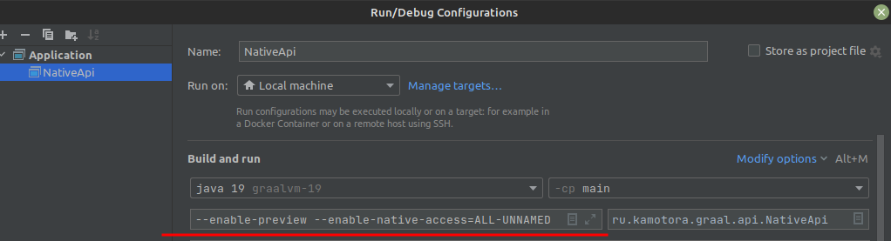

Java shared native lib examples

* [Java foreign memory API](https://docs.oracle.com/en/java/javase/17/docs/api/jdk.incubator.foreign/module-summary.html)
* Graal shared native lib
    * [First](https://www.graalvm.org/22.2/reference-manual/native-image/guides/build-native-shared-library/)
    * [Second](https://www.graalvm.org/22.0/reference-manual/native-image/ImplementingNativeMethodsInJavaWithSVM/)

---

Build shared native lib:

 ```shell
sdk use java 22.3.r17-grl
./mvnw clean package -Pnative -pl lib -am -Dmaven.test.skip=true -f pom.xml
```

Launch:
* Working dir == root project dir
* java 17: --add-modules jdk.incubator.foreign --enable-native-access=ALL-UNNAMED
* java 19: --enable-preview --enable-native-access=ALL-UNNAMED
  